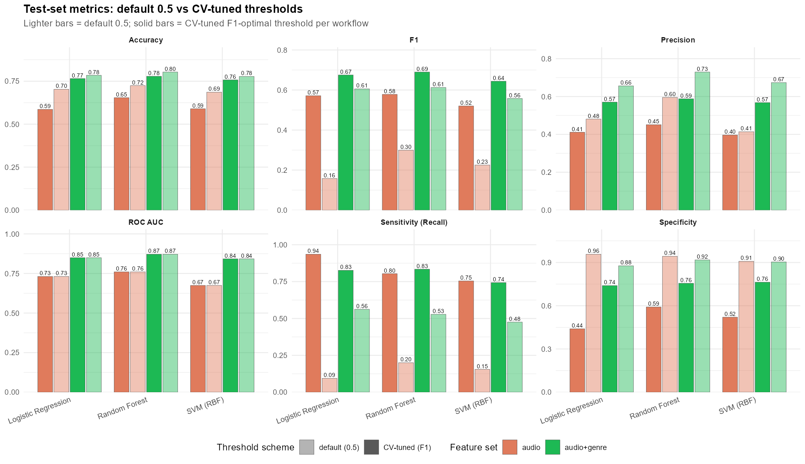
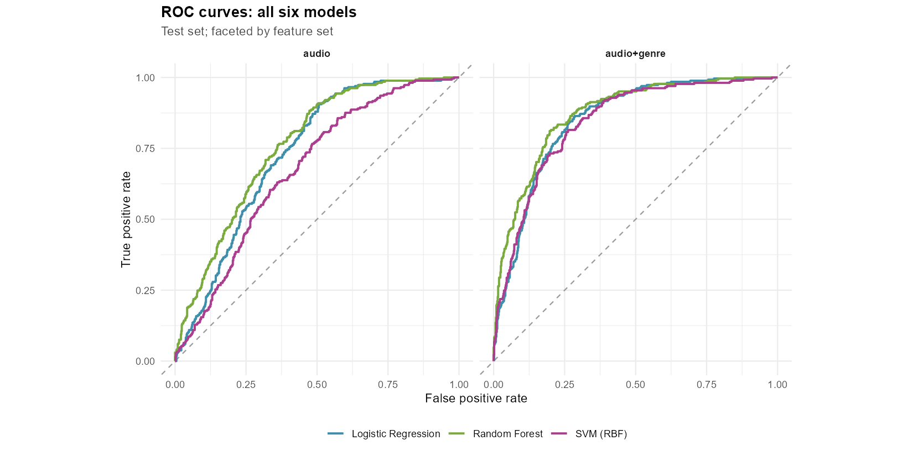

# From Beats to Hits: Predicting Spotify Song Popularity

Course project for **MIS 720 — AI and Big Data** (San Diego State University, Spring 2026), Team B2.
We ask whether a track's intrinsic audio features can predict whether it becomes a Spotify hit, and how much of that predictive signal comes from the audio itself versus the playlist-assigned genre it ships with.

## Research question

> Can Spotify's audio features predict whether a track is high-popularity, and how much of that signal is from intrinsic characteristics of the audio versus the genre tag?

Every result in this repository is paired across two parallel feature sets so that this comparison is direct:

- **`audio`** — 10 continuous audio features (danceability, energy, loudness, valence, acousticness, instrumentalness, speechiness, liveness, tempo, duration) plus `key`, `mode`, and `time_signature`.
- **`audio + genre`** — the audio set plus `playlist_genre`.

Three classifiers (logistic regression, random forest, SVM with RBF kernel) are trained on each feature set, for **6 workflows** total.

## Dataset

[Spotify Music Dataset](https://www.kaggle.com/datasets/solomonameh/spotify-music-dataset) (Kaggle, Solomon Ameh). The Kaggle release is pre-split into a high-popularity CSV and a low-popularity CSV; we reconcile schemas and combine them.

- **Working dataset:** 4,494 unique tracks after dedup by `track_id`.
- **Response:** `high_popularity = (track_popularity > 68)`. Class split 29.5% High / 70.5% Low.
- **Features modeled:** 10 continuous audio features + `key` + `mode` + `time_signature` + (optionally) `playlist_genre`.

The threshold of 68 is the cutoff used by the Kaggle author to pre-split the two source files; we keep it for consistency.

## Headline results

| Model | Feature set | Test ROC AUC | Test F1 (CV-tuned threshold) | Tuned threshold |
|---|---|---:|---:|---:|
| **Random Forest** | **audio + genre** | **0.872** | **0.690** | 0.33 |
| Logistic Regression | audio + genre | 0.849 | 0.675 | 0.29 |
| SVM (RBF) | audio + genre | 0.842 | 0.644 | 0.19 |
| Random Forest | audio | 0.760 | 0.578 | 0.31 |
| Logistic Regression | audio | 0.731 | 0.571 | 0.23 |
| SVM (RBF) | audio | 0.674 | 0.520 | 0.25 |

Full numbers in [output/test_metrics_summary.csv](output/test_metrics_summary.csv) (default 0.5 threshold) and [output/threshold_comparison.csv](output/threshold_comparison.csv) (default vs CV-tuned, side by side).



### Key takeaways

1. **Genre is doing a lot of the work.** Adding `playlist_genre` to the audio features lifts test ROC AUC by **0.07–0.17** across all three model families. The lift is consistent and large.
2. **Random Forest on audio + genre is the best workflow** by every metric we report. AUC 0.872, CV-tuned F1 0.690.
3. **Loudness, instrumentalness, acousticness, and energy are the audio features that matter most.** When `playlist_genre` is excluded, instrumentalness and loudness dominate; when it is included, genre dominates by a wide margin and the same audio features retain secondary importance. See [figures/models/interp_permutation_importance_all.png](figures/models/interp_permutation_importance_all.png).
4. **Threshold tuning matters here.** At the default 0.5 cutoff, sensitivity for the High class collapses to 0.09–0.20 because the cutoff doesn't intersect a 30/70 prior usefully. Tuning the threshold per-workflow on CV out-of-fold F1 (selected thresholds 0.19–0.33) lifts sensitivity by 0.20–0.84 absolute, at the cost of a few points of precision.
5. **SVM (RBF) is consistently the weakest of the three models** on AUC, F1, and Brier score, even after explicitly constraining the `cost` and `rbf_sigma` search ranges away from degenerate corners.



## Pipeline

Two scripts run in strict order; the second consumes an artifact produced by the first.

1. **[01_eda.R](01_eda.R)** — loads both CSVs, reconciles to common columns, dedupes by `track_id`, builds the binary response, recodes `key`/`mode` to readable labels, runs univariate and bivariate EDA, writes figures to [figures/](figures/) and the cleaned dataset to [output/spotify_clean.rds](output/spotify_clean.rds) (and `.csv`).
2. **[02_modeling.R](02_modeling.R)** — reads the cleaned RDS, stratified 80/20 split, 5-fold CV on the train set, trains 3 models × 2 feature sets = 6 `tidymodels` workflows, tunes hyperparameters on `roc_auc`, evaluates on the held-out test set, sweeps the decision threshold for F1 on out-of-fold CV predictions, generates per-model and cross-model plots into [figures/models/](figures/models/), and writes RDS artifacts (fitted workflows, predictions, metrics, importances, thresholds) to [output/](output/).

`02_modeling.R` requires `output/spotify_clean.rds` to exist — run `01_eda.R` first if it is missing or stale.

### Methods summary

- **Train/test:** 80/20 stratified by class, seed 42. Train n = 3,595, test n = 899.
- **CV:** 5-fold stratified, train set only.
- **Tuning objective:** ROC AUC (threshold-independent, robust to class imbalance).
- **Random forest:** `ranger`, 500 trees, `mtry` and `min_n` tuned via 20-point space-filling grid.
- **SVM:** `kernlab` RBF, `cost ∈ [2^-2, 2^8]` and `rbf_sigma ∈ [1e-4, 1e-1]` via 20-point space-filling grid. Default `dials` ranges include degenerate corners and were not used.
- **Recipes:** LR and SVM share preprocessing (median/mode impute → lump rare genres at 1% → dummy → drop ZV → z-standardize). RF uses no encoding or scaling (ranger handles factors, trees are scale-invariant).
- **Threshold tuning:** F1-optimal threshold per workflow, selected on CV out-of-fold predictions, applied once to the held-out test set.
- **Cross-model permutation importance:** mean drop in test-set ROC AUC over 5 shuffles per feature, computed manually so all three model families are on a comparable scale.

## Running

R / RStudio at the repo root:

```r
source("01_eda.R")       # produces output/spotify_clean.{rds,csv}, figures/*.png
source("02_modeling.R")  # produces output/*.rds, figures/models/*.png
```

From a shell:

```sh
Rscript 01_eda.R
Rscript 02_modeling.R
```

`02_modeling.R` takes ~5–25 min depending on cores. SVM RBF tuning is the bottleneck; lower `svm_grid_size` near the top of the script to speed up. Parallelism is on by default via `doParallel`; set `use_parallel <- FALSE` to disable.

### Required packages

- **EDA:** `tidyverse`, `scales`, `ggcorrplot`
- **Modeling:** `tidymodels`, `ranger`, `kernlab`, `vip`, `doParallel`, `broom`, `patchwork`

Both scripts list the install command in their setup blocks.

## Repository layout

```
01_eda.R                 EDA pipeline → output/spotify_clean.{rds,csv}, figures/*.png
02_modeling.R            Modeling pipeline → output/*.rds, figures/models/*.png
CLAUDE.md                Coding conventions for this repo (used by Claude Code)

data/                    Source CSVs from Kaggle (high- and low-popularity files)
output/                  Cleaned dataset + saved model artifacts (RDS + CSV)
figures/                 EDA plots
figures/models/          Modeling plots (per-workflow + cross-model)
documents/               Course deliverables (proposal, Step 2, Step 3 deck, Step 4 report)
reports/                 Working notes
```

### Saved artifacts

| File | Contents |
|---|---|
| [output/spotify_clean.rds](output/spotify_clean.rds) | Cleaned, deduped dataset with response built and factors set |
| [output/final_workflows.rds](output/final_workflows.rds) | 6 fitted `tidymodels` workflows (refit on full train) |
| [output/test_predictions.rds](output/test_predictions.rds) | Per-workflow test-set predictions |
| [output/test_metrics.rds](output/test_metrics.rds) | Test metrics at threshold 0.5 |
| [output/test_metrics_tuned.rds](output/test_metrics_tuned.rds) | Test metrics at CV-tuned thresholds |
| [output/threshold_comparison.rds](output/threshold_comparison.rds) | Default vs CV-tuned, long format |
| [output/best_thresholds.rds](output/best_thresholds.rds) | CV F1-optimal threshold per workflow |
| [output/best_hyperparameters.rds](output/best_hyperparameters.rds) | Tuned hyperparameter values |
| [output/cv_metrics.rds](output/cv_metrics.rds) | CV metrics at the selected hyperparameters |
| [output/permutation_importance.rds](output/permutation_importance.rds) | Cross-model permutation importance |
| [output/pdp_rf_genre_top4.rds](output/pdp_rf_genre_top4.rds) | Partial dependence curves for the best workflow |

## Limitations

- **`playlist_genre` is not a track-level attribute.** It comes from the playlist a track was sourced from, not from the audio itself. The audio-vs-genre comparison is the cleanest way to acknowledge this: the 0.07–0.17 AUC lift from adding `playlist_genre` partly reflects curatorial signal (which playlists a track ended up on) rather than purely intrinsic track properties. The `audio`-only models are the more honest answer to the original research question.
- **Popularity threshold is somewhat arbitrary.** We use 68 because that is the cutoff the Kaggle author used to pre-split the source files. Different cutoffs would shift the class balance and the absolute metrics.
